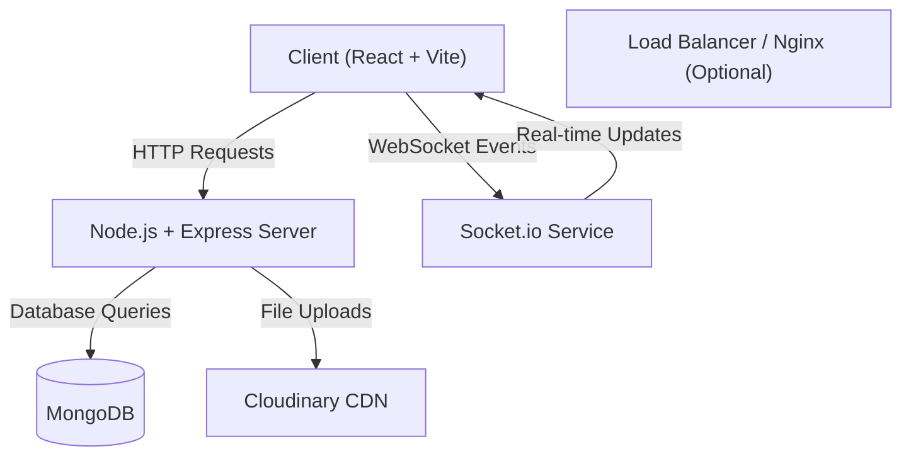

# QuickChat - Real-time Messaging Application

> A robust, scalable, and feature-rich real-time chat application built with the MERN stack and Socket.io.


## 📖 Overview

QuickChat is a sophisticated communication platform designed to provide seamless real-time messaging experiences. It leverages **WebSockets** for instant data transmission and **MongoDB** for persistent data storage. The application features a modern, responsive user interface built with **React** and **TailwindCSS**, ensuring accessibility and performance across devices.

## 🏗 Architecture

The system follows a **Client-Server** architecture decoupled via REST APIs and a full-duplex WebSocket channel.



## 🛠 Technology Stack

### Backend
*   **Runtime**: Node.js (Latest LTS)
*   **Framework**: Express.js
*   **Database**: MongoDB (managed via Mongoose)
*   **Real-time Engine**: Socket.io
*   **Authentication**: JWT (JSON Web Tokens) & Cookies
*   **Media Storage**: Cloudinary using Multer
*   **Security**: Bcrypt (hashing), CORS configuration, Helmet (implied best practice)

### Frontend
*   **Framework**: React 19 (via Vite)
*   **Language**: TypeScript
*   **Styling**: TailwindCSS 4, Shadcn/Radix UI Primitives (implied by dependencies), Lucide React
*   **State Management**: Zustand
*   **HTTP Client**: Axios
*   **Forms**: React Hook Form + Zod Validation

## 🚀 Key Features

*   **Real-time Messaging**: Instant delivery of messages, typing indicators, and online status.
*   **User Authentication**: Secure Signup/Login flow with JWT and HTTP-only cookies.
*   **Media Sharing**: Image upload capability integrated seamlessly into the chat flow.
*   **User Profiles**: Customizable profiles with avatars and status.
*   **Responsive Design**: Mobile-first approach using TailwindCSS.
*   **Group & 1-to-1 Chat**: Flexible conversation models.

## ⚙️ Installation & Setup

### Prerequisites
*   Node.js (v18 or higher)
*   MongoDB Instance (Local or Atlas)
*   Cloudinary Account (for media features)

### 1. Clone the Repository
```bash
git clone https://github.com/your-username/QuickChat.git
cd QuickChat
```

### 2. Backend Setup
Navigate to the backend directory and install dependencies:
```bash
cd backend
npm install
```

Create a `.env` file in `backend/` based on the following template:
```env
# Server Configuration
PORT=5001
CLIENT_URL=http://localhost:5173
FRONTEND_URL=http://localhost:5173

# Database
MONGODB_CONNECTIONSTRING=mongodb+srv://<user>:<password>@cluster.mongodb.net/quickchat

# Security
ACCESS_TOKEN_SECRET=your_super_secret_jwt_key

# Cloudinary (Media Storage)
CLOUDINARY_CLOUD_NAME=your_cloud_name
CLOUDINARY_API_KEY=your_api_key
CLOUDINARY_API_SECRET=your_api_secret

# Email Service (Optional - for Password Reset)
EMAIL_SERVICE=gmail
EMAIL_USER=your_email@gmail.com
EMAIL_PASSWORD=your_app_password
```

Start the Development Server:
```bash
npm run dev
# Server will run on http://localhost:5001
```

### 3. Frontend Setup
Navigate to the frontend directory and install dependencies:
```bash
cd ../frontend
npm install
```

Create a `.env` file in `frontend/` (if required by your logic, otherwise Vite usually proxies or uses constants):
```env
VITE_API_URL=http://localhost:5001/api
```

Start the Frontend Application:
```bash
npm run dev
# App will run on http://localhost:5173
```

## 📂 Project Structure

```
QuickChat/
├── backend/                # Node.js Server
│   ├── src/
│   │   ├── controllers/    # Request Handlers
│   │   ├── models/         # Database Schemas
│   │   ├── routes/         # API Endpoints
│   │   ├── services/       # Business Logic
│   │   ├── socket/         # Socket.io Events
│   │   ├── middlewares/    # Auth & Error Handling
│   │   ├── libs/           # DB & 3rd Party Clients
│   │   └── utils/          # Helper Functions
│   └── package.json
│
├── frontend/               # React Client
│   ├── src/
│   │   ├── components/     # Reusable UI Components
│   │   ├── pages/          # Route Views
│   │   ├── stores/         # Zustand State Stores
│   │   ├── services/       # API Integration
│   │   ├── hooks/          # Custom Hooks
│   │   └── types/          # TypeScript Definitions
│   └── package.json
│
└── README.md               # Documentation
```

## 🤝 Contributing

1.  Fork the Project
2.  Create your Feature Branch (`git checkout -b feature/AmazingFeature`)
3.  Commit your Changes (`git commit -m 'Add some AmazingFeature'`)
4.  Push to the Branch (`git push origin feature/AmazingFeature`)
5.  Open a Pull Request

## 👤 Author

**Huy & PhD Mentor**
*   **Role**: Senior Principal Software Engineer & Researcher
*   **Focus**: Embedded Systems, High-Performance Computing, and Algorithm Optimization.

## 📄 License

Distributed under the ISC License. See `package.json` for more information.
